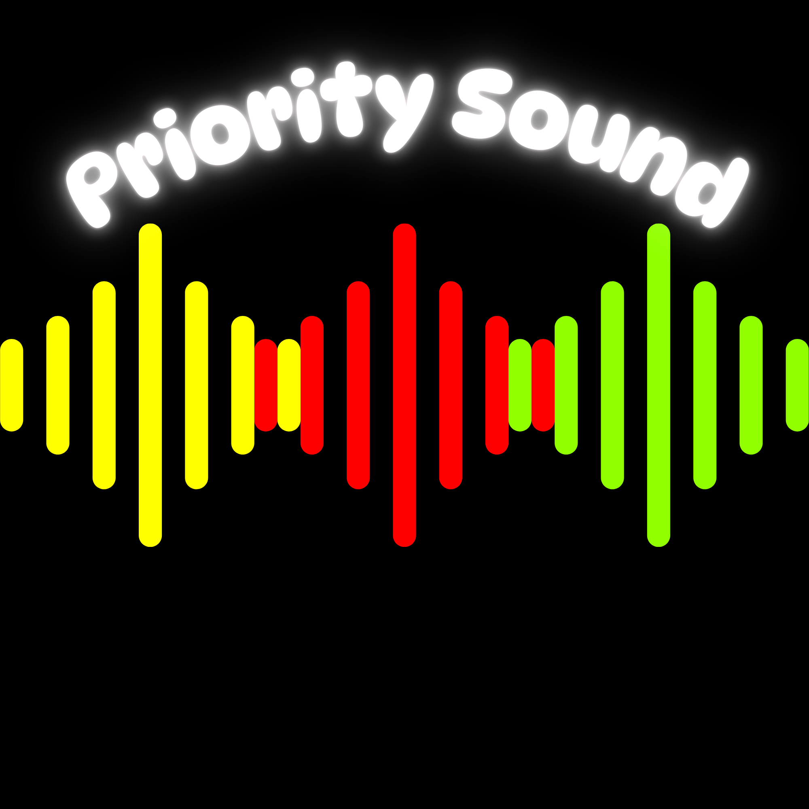

# PrioritySound -– Real-Time Sound Awareness for the Deaf and Hard-of-Hearing

## Problem Statement 

Over 1.5 billion people worldwide experience some degree of hearing loss, with many facing significant challenges in perceiving critical environmental sounds. These sounds—such as alarms, sirens, door knocks, or a baby crying—play an essential role in safety, awareness, and daily functioning. Existing assistive solutions often fall short because they:
- Treat all sounds equally without prioritizing urgency
- Deliver delayed or unreliable notifications
- Lack intuitive, real-time visual interfaces
- Do not provide spatial awareness of where sounds originate

As a result, Deaf and Hard-of-Hearing individuals may miss time-sensitive auditory cues, increasing safety risks, reducing independence, and causing stress in everyday situations.

There is a need for a system that can intelligently detect, prioritize, and visually represent environmental sounds in real time, while also conveying where those sounds are coming from in a clear and accessible way. 

## Our Solution and Key Features

PrioritySound uses machine learning to deliver intelligent sound detection and accessibility:
- **Live Sound Detection**: Constantly monitors microphone input to analyze sounds consistently
- **Machine Learning Classification**: Uses trained deep learning models to identify and label environmental sounds
- **Priority-Based Alerts**: Categorizes sounds as Emergency, High, Medium, or Low based on safety risk
- **Real-Time Dashboard**: Displays visual alerts, status, and activity history optimized for deaf and hard-of-hearing users
- **AR Visual Sound Mapping**: Overlays directional alerts onto a live webcam feed to help users locate sounds
- **Customizable Modes**: Adjusts priorities and alert styles based on user context (Parent, Outside, School, Home)

## Software Technology

Priority Sound is built by integrating...
- CSS: for UI design and styling
- HTML: page structure
- Javascript: Frontend
- Python: backend
- Machine Learning Models: Sound classification

## How It Works

1. PrioritySound uses machine learning to:
2. Detect live audio input from a microphone
3. Classify sounds into categories
4. Assign priority levels (Emergency, High, Medium, Low)
5. Display alerts in real time

## Audio Classification

PrioritySound uses machine-learning to classify environmental sounds in real time. Built on transformer-based architecture, the system:
- Analyzes audio spectral features to identify sound types
- Assigns confidence scores to each classification
- Automatically prioritizes sounds based on urgency levels (Emergency, High, Medium, Low)
- Continuously learns and adapts to new environmental contexts

The model is trained on diverse sound datasets including alarms, sirens, appliances, and human-generated sounds, ensuring reliable detection across various environments.

## Augmented Reality Sound Mapping

A web-based AR feature that overlays detected sounds onto a live webcam feed. The system:
- Estimates sound direction (Left, Center, Right)
- Displays color-coded visual indicators based on urgency
- Example: Red alert for sirens, yellow notification for door knocks
- Provides spatial awareness for users to locate sounds in their environment

## Modes

PrioritySound includes four customizable environment modes that adjust sound prioritization based on context:

Available Modes:
- **Parent Mode**: Prioritizes baby crying, glass breaking, door knocks, and smoke alarms
- **Outside Mode**: Prioritizes emergency sirens, car horns, and traffic alerts
- **School Mode**: Prioritizes lockdown alarms, fire alarms, and school bells
- **Home Mode**: Prioritizes doorbells, appliance alarms, and security alerts

Each mode automatically adjusts priority levels, alert styles, and filters out low-importance noise for relevant, timely alerts.

## Installation

1. Clone the repository:
   ```
   git clone https://github.com/shreshmello/software-design-code.git
   cd software-design-code
   ```

2. Install the required dependencies:
   ```
   pip install -r requirements.txt
   ```

3. Run the application:
   ```
   python app.py
   ```

4. Open your browser and navigate to `http://localhost:5000` to access the web dashboard.

## Usage

- **Web Interface**: Register or log in to access the dashboard. Start detection to begin monitoring sounds.
- **Console Mode**: Run `python main.py` for a command-line version of the application.
- **Configuration**: Adjust user preferences in the settings to customize alert behaviors.

## Technologies Used

- **Backend**: Flask, SQLAlchemy
- **Machine Learning**: Transformers, PyTorch, NumPy
- **Audio Processing**: SoundDevice
- **Frontend**: HTML, CSS, JavaScript

## Citation

```bibtex
@article{wolf2019huggingface,
  title={Huggingface's transformers: State-of-the-art natural language processing},
  author={Wolf, Thomas and Debut, Lysandre and Sanh, Victor and Chaumond, Julien and Delangue, Clement and Moi, Anthony and Cistac, Pierric and Rault, Tim and Louf, R{\'e}mi and Funtowicz, Morgan and Davison, Joe and Shleifer, Sam and von Platen, Patrick and Ma, Clara and Jernite, Yacine and Plu, Julien and Xu, Canwen and Le Scao, Teven and Gugger, Sylvain and Drame, Mariama and Lhoest, Quentin and Rush, Alexander},
  journal={arXiv preprint arXiv:1910.03771},
  year={2019}
}
@misc{L;, title={Risk perception and perceived self-efficacy of deaf and hard-of-hearing seniors and young adults in emergencies},
 url={https://pubmed.ncbi.nlm.nih.gov/28822214/}, 
journal={American journal of disaster medicine}, 
publisher={U.S. National Library of Medicine}, author={L;, Engelman A;Ivey SL;Tseng W;Neuhauser}} 
```

## License

This project is open-source. Please check the license file for details.


